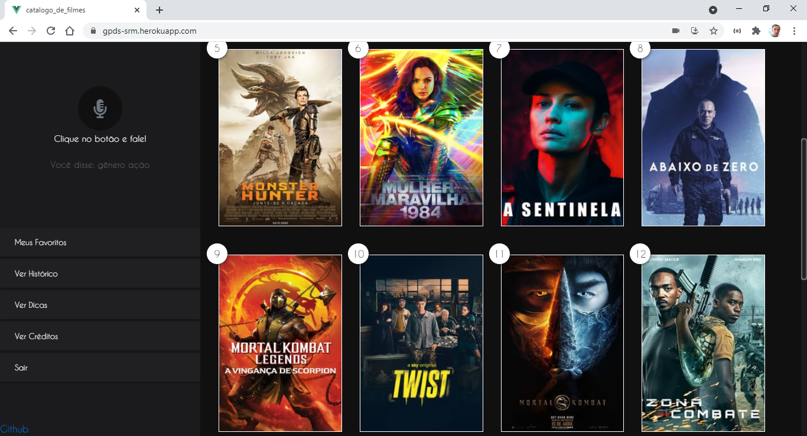

# Gestão de Processos de Desenvolvimento de Software 

De acordo com o a liberdade do tema foi criado um projeto para utilizar o recurso de reconhecimento de voz para buscar informações sobre filmes utilizando a plataforma web (HTML5 , JS e VUEJS).

[](https://img.shields.io/github/license/robsoncartes/gpds/blob/master/LICENSE.md)


## Project setup
```
npm install
```

### Compiles and hot-reloads for development
```
npm run serve
```

### Compiles and minifies for production
```
npm run build
```

### Lints and fixes files
```
npm run lint
```

### Customize configuration
See [Configuration Reference](https://cli.vuejs.org/config/).


### Team Scrum

|		**Nome**    	|				**Github**            	|           **Role**            |
|:--------------------:	|:-------------------------------------:|:-----------------------------:|
| Alexandre Ramos 		| 					N/A 				|   Developer                   |
| Lucas Chaves 	        |   https://github.com/lucas-chaves  	|   Product Owner               |
| Robson Sousa		    |   https://github.com/robsoncartes 	|   Scrum Master                |
| Rodolfo Santos 		|   https://github.com/rodolfo-santos   |   Developer / Product Owner   |

## Requisitos

- Buscar filmes
- Histórico de pesquisa
- Sinopse do filme
- Buscar por gênero Filmes
- Ver poster
- Ler sinopse

## Organization
See [gpds wiki](https://github.com/robsoncartes/gpds/wiki).

See [gpds-workspace](https://app.zenhub.com/workspaces/gpds-workspace-5ec82b3f812f89a3173d90c3/board?repos=266192933).
